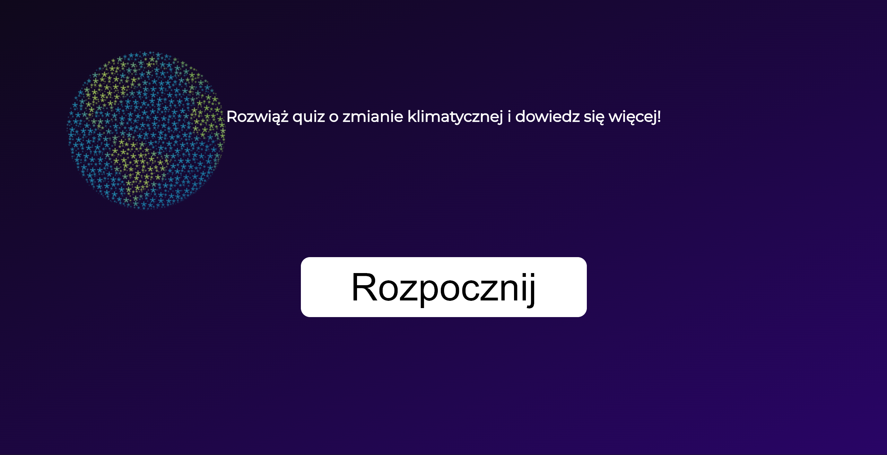
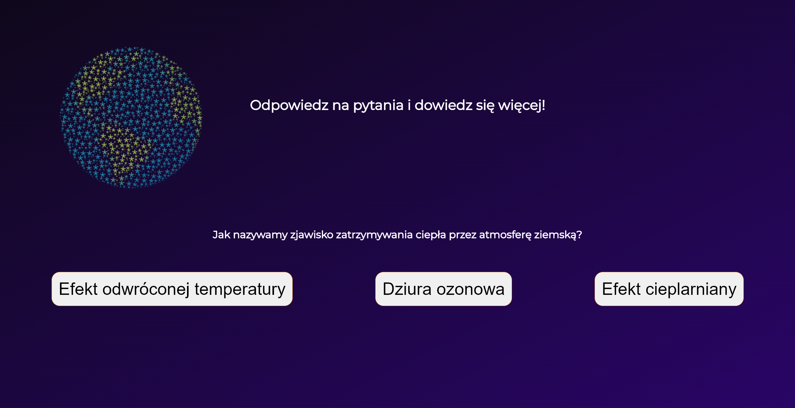
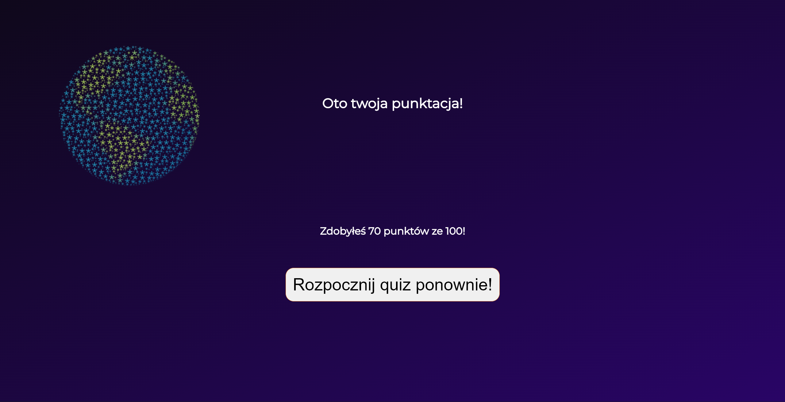
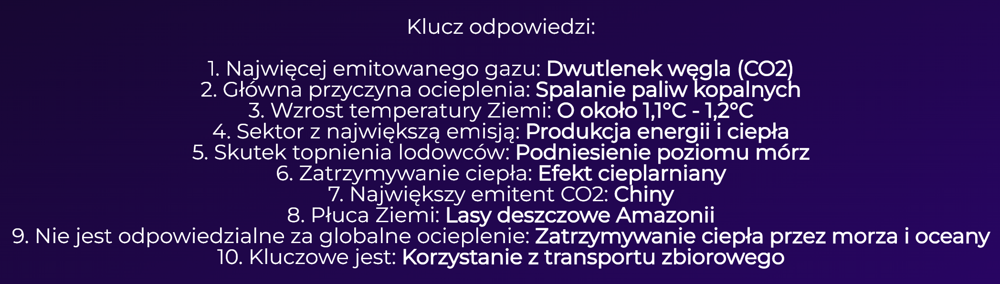

# Ten projek jest edukacyjnym quizem klimatycznym, który ma być też szablonem. Zapraszam do dokumentacji!

## O projekcie
Projek ten został stworzony jako projekt kmońcowy na kursie Kodland i nazewnictwo niektórych elementów może być sprzeczne z ich funkcją, niektóre części kodu też mogą być zbędne do normalnej operacji kodu.
Jest tak dlatego, że ten projekt bazuje na innym projekcie z odmienną funkcją od tego i jest jego bardzo mocno zmodyfikowaną wersją tamtego projektu.

## Jak zainstalować
1. Pobierz wszystkie pliki z folderu Quiz
2. Otwórz ten plik w swoim IDE (np. Visual Studio Code)
3. Zainstaluj Flask wpisując w terminal ```pip install flask```
4. Uruchom plik main.py
​
## Jak dostosować do swoich potrzeb
- zawiera wybrane informacje dotyczące edytowania quizu
### Aby dodawać odpowiedzi
1. Znajdź podstronę, w której chcesz dodać odpowiedzi
2. Zlokalizuj tą odpowiedź
3. Skopiuj kod odpowiedzialny za odpowiedź (patrz poniżej)
```html
      <li class="list__item">
        <form action="/pytXX" method="POST">
            <input type="hidden" name="score" value="{{ score }}">
            <button type="submit" class="list__item"><span> TWOJE PYTANIE TU </span></button>
        </form>
      </li>
```
- Mała uwaga - jak chcesz, by ta odpowiedź dodawała punkty, to musisz w ```value="{{ score }}``` zmienić ```{{ score }}``` na ```{{ score | int + 10}}```. To doda graczowi 10 punktów. Muszisz też zmienić w```form action="/pytXX"``` to *XX* na liczbę z innych odpowiedzi w danym pytaniu.

### Aby zmienić tło
- Mała uwaga - po zmianie tła w ```style.css``` tło nie będzie takie same jak w ```style1.css``` i ```sytle2.css```, ale wszystko jest tam w niemal identycznych miejscach.
1. Znajdź w ```style.css``` linijkę nr. 10
2. Znajdź sobie zdjęcie / kolory do gradientu / kolor tła, dodatkowo możesz dodać swój obrazek.
(opcjonalne) 3. Jeśli nie masz żadnego zdjęcia na tło to usuń ```url("../img/Ziemia.png"),```. Przecinek też trzeba usunąć!
4. Zastąp *Ziemia.png* swoją nazwą zdjęcia jeśli je masz, pamiętając o jego rozszeżeniu (np .jpg)
5. Zmień faktyczne tło na obraz korzystając z ```url("../img/ OBRAZEK ")``` lub na pojedyńczy kolor używając ```background-color: #KOLOR;```i zastępując *KOLOR* kolorem

### Aby dodać kolejne pytania
1. Skopiuj jeden z plików html z pytaniami, np.```lights1.html```
2. Zmień pytania na takie, które Ci odpowiadają (*patrz: punkt trzeci dodawania pytań*)
3. Zmień adresy - musisz zmienić adres przekierowujący na następną stronę w pytaniu, który teraz robisz. Jeśli to ostatnie pytanie zmień je na ```/wyniki```. Jeśli nie, to poprostu dodawaj w *pytXX* do tego *XX* liczbę
4. Zmień nazwę pliku na dowolną nazwę
5. W pliku, który był poprzednio ostatnim pytaniem zmień adres przekierowujący na następny *pyt*. Mam przez to na myśli, że zmieniasz w poprzedniej ostatniej stronie ten adres zawierający */pyt* z cyferką na końcu na następną cyferkę. Ma być ona następna "względem" poprzedniego pytania
6. W ```main.py``` dodaj kolejną formułkę do przekierowywania stron
```python
@app.route('/pytXX', methods=['POST'])
def NAZWA():
    aktualny_wynik = request.form.get('score')
    return render_template('NAZWA PLIKU.html', score=aktualny_wynik)
```
7. Skopiuj powyższy kod pod innymi takimi skrawkami i zmień:
   - XX na numer pytania
   - NAZWA na cokolwiek (nie jest ważne, byle się nie powtarzało między innymi takimi skrawkami)
   - NAZWA PLIKU na nazwę pliku, zależy jak nazwałeś swój plik
8. Pamiętaj, że na końcu trzeba zmienić punktację. Zmień ```name="score" value="{{ score }}"``` tak, by tylko nad prawidłową odpowiedzią widniało ```name="score" value="{{ score | int + LICZBA PUNKTÓW}}"```
9. Radzę też odświeżyć klucz odpowiedzi, bądź się go pozbyć.

## Galeria

**Rozpoczęcie Quizu**

**Przykładowe pytanie**

**Zdobyłem 50 punktów!**

**Klucz odpowiedzi**



